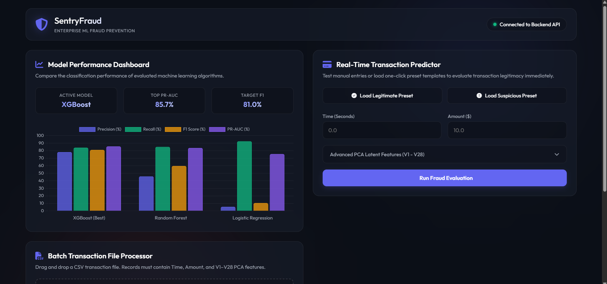
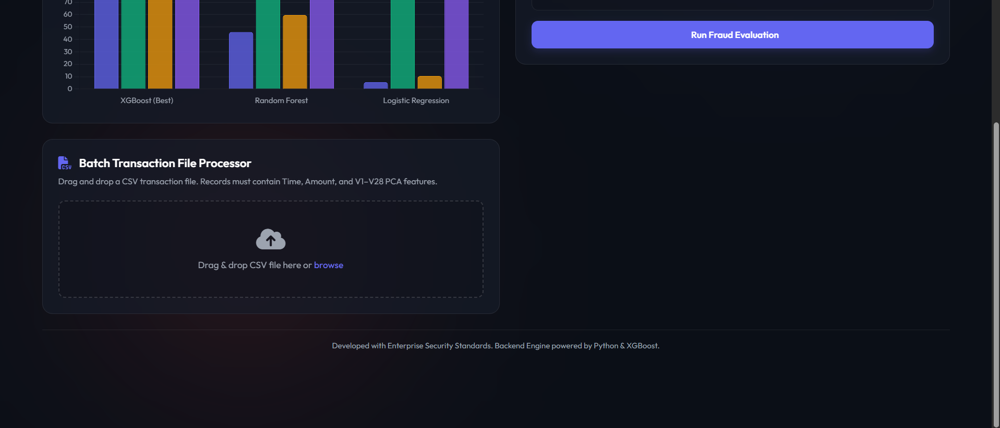
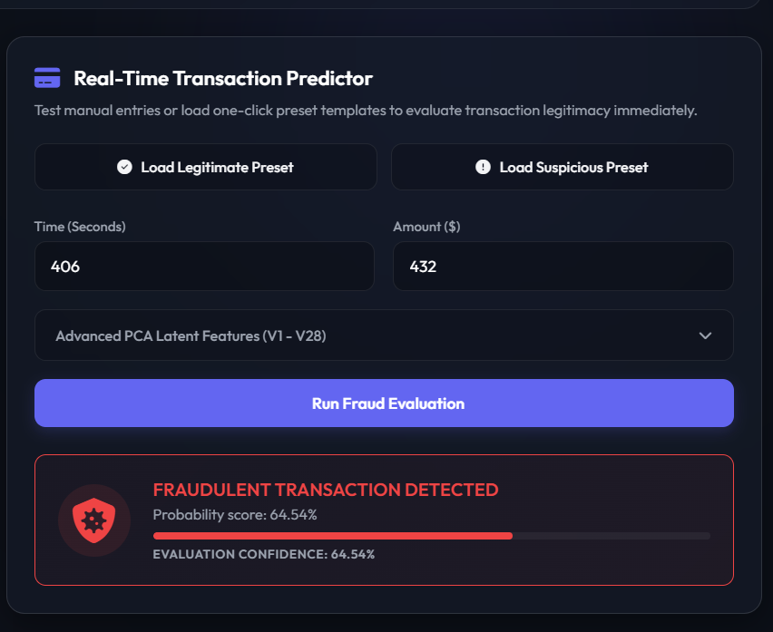
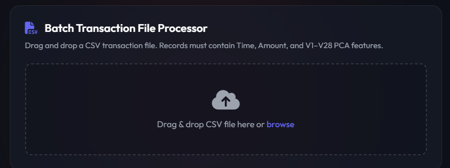
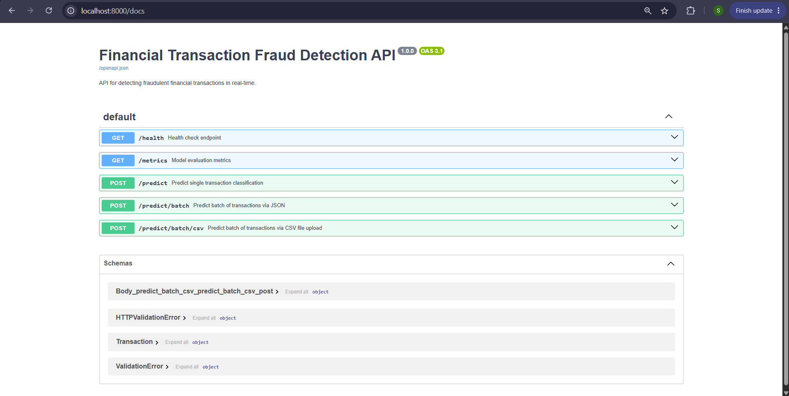
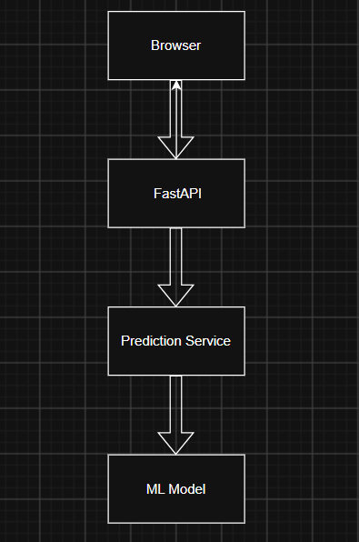
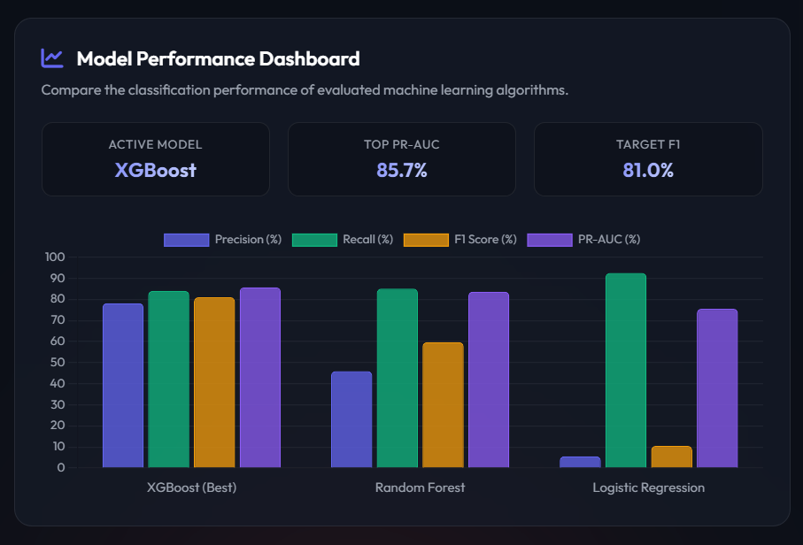

# 💳 Financial Transaction Fraud Detection Platform

<p align="center">


</p>

> **Status:** ✅ Completed (Internship Project)

A **Machine Learning-powered Financial Transaction Fraud Detection Platform** that detects fraudulent financial transactions using supervised learning models and serves predictions through a **FastAPI REST API** and an interactive web dashboard.

The project demonstrates a complete end-to-end Machine Learning workflow—from **data preprocessing** and **exploratory data analysis (EDA)** to **model training**, **evaluation**, **deployment**, and **real-time prediction**.

---

# 📑 Table of Contents

- [📸 Application Preview](#-application-preview)
- [🎥 Demo](#-demo)
- [✨ Features](#-features)
- [📖 Project Overview](#-project-overview)
- [🎯 Objectives](#-objectives)
- [📊 Dataset](#-dataset)
- [🔄 Project Workflow](#-project-workflow)
- [🤖 Machine Learning Models](#-machine-learning-models)
- [🏆 Best Performing Model](#-best-performing-model)
- [🛠 Technologies Used](#️-technologies-used)
- [📂 Project Structure](#-project-structure)
- [🚀 Installation](#-installation)
- [▶️ Running the Application](#️-running-the-application)
- [🔌 REST API](#-rest-api)
- [🏗 System Architecture](#️-system-architecture)
- [📈 Future Improvements](#-future-improvements)
- [👥 Team Members](#-team-members)
- [📄 License](#-license)
- [⭐ Acknowledgements](#-acknowledgements)

---

# 🎥 Demo

The application consists of:

- 🤖 Machine Learning Fraud Detection
- ⚡ FastAPI REST Backend
- 🌐 Interactive Web Dashboard
- 📁 Batch CSV Prediction
- 📊 Model Metrics Dashboard
- 📚 Swagger API Documentation

The screenshots below demonstrate the locally deployed application.

---

# 📸 Application Preview

## 🖥 Dashboard





---

## 🔍 Fraud Prediction



---

## 📁 Batch Prediction



---

## 📚 FastAPI Documentation



---

## 🏗 System Architecture



---

## 📈 Model Metrics Dashboard



---

# ✨ Features

- 🤖 Machine Learning-based fraud detection
- 📊 Interactive dashboard
- ⚡ FastAPI REST API
- 🔍 Real-time transaction prediction
- 📁 Batch CSV prediction
- 📈 Model performance visualization
- 📉 Prediction confidence score
- 🧠 Multiple ML model comparison
- 💾 Model persistence using Joblib
- 📚 Interactive Swagger API documentation
- 🏗 Modular project architecture
- 🎯 Future-ready for dataset replacement and deployment

---

# 📖 Project Overview

Financial fraud has become one of the biggest challenges in modern digital payment systems. Traditional rule-based fraud detection methods often struggle to detect evolving fraud patterns, resulting in financial losses and operational inefficiencies.

This project applies supervised Machine Learning algorithms to automatically classify financial transactions as **Legitimate** or **Fraudulent** by learning hidden patterns from historical transaction data.

Developed as part of an internship, this project demonstrates practical implementation of:

- Machine Learning
- Data Analysis
- Data Preprocessing
- API Development
- Frontend Integration
- Modern Software Engineering Practices

---

# 🎯 Objectives

- Analyze financial transaction data
- Perform data cleaning and preprocessing
- Handle class imbalance using SMOTE
- Conduct Exploratory Data Analysis (EDA)
- Train and compare multiple Machine Learning models
- Evaluate models using industry-standard metrics
- Save the best-performing model
- Build a REST API for inference
- Develop an interactive web dashboard
- Demonstrate real-time fraud prediction

---

# 📊 Dataset

This project uses the **Credit Card Fraud Detection Dataset** from Kaggle.

### Dataset Source

https://www.kaggle.com/datasets/mlg-ulb/creditcardfraud

### Dataset Features

| Feature | Description                          |
| ------- | ------------------------------------ |
| Time    | Seconds elapsed between transactions |
| Amount  | Transaction amount                   |
| V1-V28  | PCA-transformed anonymized features  |
| Class   | 0 = Legitimate, 1 = Fraud            |

> **Note**
>
> The dataset has been anonymized using **Principal Component Analysis (PCA)** to protect sensitive financial information. Therefore, features **V1–V28** are latent variables rather than real banking transaction attributes.

> **Project Limitation**
>
> Since the dataset is anonymized, the application currently predicts using PCA-transformed features rather than real transaction attributes. Future versions of this project will migrate to more realistic datasets such as **PaySim** or **IEEE-CIS Fraud Detection**.

> **Dataset Not Included**
>
> Due to GitHub file size limitations, the dataset is not included in this repository.
>
> Download **creditcard.csv** from Kaggle and place it inside the `data/` directory before running the project.

---

# 🔄 Project Workflow

```text
Dataset Collection
        │
        ▼
Data Cleaning
        │
        ▼
Exploratory Data Analysis
        │
        ▼
Feature Scaling
        │
        ▼
SMOTE (Class Balancing)
        │
        ▼
Model Training
        │
        ▼
Model Evaluation
        │
        ▼
Best Model Selection
        │
        ▼
Model Persistence (.pkl)
        │
        ▼
FastAPI Backend
        │
        ▼
Interactive Dashboard
```

> **Note:** The notebook is used exclusively for experimentation and model training. All deployment and inference logic resides in the modular `src/` directory.

---

# 🤖 Machine Learning Models

The following supervised Machine Learning algorithms were implemented, trained, and evaluated:

| Model                    | Description                                                           |
| ------------------------ | --------------------------------------------------------------------- |
| Logistic Regression      | Baseline linear classification model                                  |
| Random Forest Classifier | Ensemble learning model using multiple decision trees                 |
| XGBoost Classifier       | Gradient Boosting algorithm optimized for high predictive performance |

Each model was trained using the preprocessed dataset and evaluated using multiple performance metrics to determine the best-performing classifier.

---

# 🏆 Best Performing Model

The best-performing model is automatically serialized using **Joblib** and loaded by the FastAPI backend for inference.

### Evaluation Metrics

> Replace the placeholder values below with your final results.

| Metric        | Score  |
| ------------- | ------ |
| Accuracy      | XX.XX% |
| Precision     | XX.XX% |
| Recall        | XX.XX% |
| F1 Score      | XX.XX% |
| ROC-AUC Score | XX.XX% |

Additional evaluation includes:

- Confusion Matrix
- Classification Report
- ROC Curve
- Precision-Recall Curve

---

# 🛠️ Technologies Used

### Programming Language

- Python

### Machine Learning

- Scikit-Learn
- XGBoost
- Imbalanced-Learn (SMOTE)
- Joblib

### Data Analysis

- Pandas
- NumPy

### Data Visualization

- Matplotlib
- Seaborn

### Backend Development

- FastAPI
- Uvicorn
- Pydantic

### Frontend Development

- HTML5
- CSS3
- JavaScript

### Development Tools

- Google Colab
- Git
- GitHub

---

# 📂 Project Structure

```text
financial-transaction-fraud-detection/
│
├── data/
│   └── creditcard.csv
│
├── models/
│   ├── best_fraud_model.pkl
│   └── scalers.pkl
│
├── notebooks/
│   └── Fraud_Detection.ipynb
│
├── reports/
│   ├── Literature_Review.pdf
│   ├── Final_Report.pdf
│   └── Presentation.pptx
│
├── screenshots/
│   ├── dashboard.png
│   ├── dashboard_2.png
│   ├── prediction.png
│   ├── batch_upload.png
│   ├── api_docs.png
│   ├── architecture.png
│   └── metrics.png
│
├── src/
│   ├── api.py
│   ├── preprocessing.py
│   ├── predict.py
│   ├── test_api.py
│   └── web/
│       ├── index.html
│       ├── style.css
│       └── app.js
│
├── README.md
├── requirements.txt
└── .gitignore
```

### Directory Overview

| Folder             | Purpose                                          |
| ------------------ | ------------------------------------------------ |
| `data/`            | Stores the dataset used for training             |
| `models/`          | Saved trained model and preprocessing artifacts  |
| `notebooks/`       | Model training and experimentation               |
| `reports/`         | Literature review, reports, and presentation     |
| `screenshots/`     | Application screenshots displayed in this README |
| `src/`             | Source code for deployment                       |
| `src/web/`         | Frontend dashboard                               |
| `README.md`        | Project documentation                            |
| `requirements.txt` | Python dependencies                              |

---

# 🚀 Installation

## 1. Clone the Repository

```bash
git clone https://github.com/Raghav-Pareek15048/financial-transaction-fraud-detection.git

cd financial-transaction-fraud-detection
```

---

## 2. Install Dependencies

```bash
pip install -r requirements.txt
```

---

## 3. Download the Dataset

Download the **Credit Card Fraud Detection Dataset** from Kaggle.

Place the dataset as follows:

```text
data/
└── creditcard.csv
```

---

## 4. Verify Saved Models

Ensure the following files exist:

```text
models/
├── best_fraud_model.pkl
└── scalers.pkl
```

These artifacts are generated after training and are required for prediction.

---

## 5. Verify the Local Pipeline

Run the integration test:

```bash
python src/test_api.py
```

Successful execution confirms that:

- Model loads correctly
- Scalers load correctly
- Prediction pipeline is functioning
- FastAPI backend is ready

# ▶️ Running the Application

The application consists of two main components:

1. **FastAPI Backend**
2. **Interactive Web Dashboard**

---

## Step 1 — Start the FastAPI Backend

From the project root directory, run:

```bash
uvicorn src.api:app --reload
```

The API will be available at:

```text
http://127.0.0.1:8000
```

---

## Step 2 — API Documentation

FastAPI automatically generates interactive API documentation.

### Swagger UI

```text
http://127.0.0.1:8000/docs
```

### ReDoc

```text
http://127.0.0.1:8000/redoc
```

---

## Step 3 — Launch the Frontend

You can either:

### Option 1

Open

```text
src/web/index.html
```

directly in your browser.

---

### Option 2 (Recommended)

Run a local server:

```bash
python -m http.server 8080 --directory src/web
```

Open:

```text
http://localhost:8080
```

---

# 🔌 REST API

The backend exposes the following REST endpoints.

| Method | Endpoint             | Description                        |
| ------ | -------------------- | ---------------------------------- |
| GET    | `/health`            | Verify API health and model status |
| GET    | `/metrics`           | Retrieve model evaluation metrics  |
| POST   | `/predict`           | Predict a single transaction       |
| POST   | `/predict/batch/csv` | Predict fraud from uploaded CSV    |

---

## Example Prediction Request

```json
{
  "Time": 1024,
  "Amount": 245.75,
  "V1": -1.32,
  "V2": 0.47,
  "...": "...",
  "V28": 0.12
}
```

---

## Example Prediction Response

```json
{
  "prediction": "Fraud",
  "confidence": 98.74,
  "risk_level": "High"
}
```

---

# 🏗️ System Architecture

```text
                    User
                      │
                      ▼
      ┌─────────────────────────┐
      │ Web Dashboard (HTML/CSS)│
      └─────────────┬───────────┘
                    │
                    ▼
        FastAPI REST Backend
                    │
        ┌───────────┴───────────┐
        │                       │
        ▼                       ▼
 Data Preprocessing      Prediction Engine
        │                       │
        └───────────┬───────────┘
                    ▼
      Trained Machine Learning Model
                    │
                    ▼
          Fraud / Legitimate Result
```

---

# ⚙️ Model Pipeline

```text
Dataset
   │
   ▼
Data Cleaning
   │
   ▼
EDA
   │
   ▼
Feature Scaling
   │
   ▼
SMOTE
   │
   ▼
Model Training
   │
   ▼
Model Evaluation
   │
   ▼
Save Best Model
   │
   ▼
FastAPI
   │
   ▼
Web Dashboard
```

---

# 📈 Future Improvements

This project serves as a strong foundation for a production-grade fraud detection platform.

Future enhancements include:

- Replace the current PCA-based dataset with **PaySim**.
- Support the **IEEE-CIS Fraud Detection Dataset**.
- Real-time transaction streaming using WebSockets.
- Docker containerization.
- Kubernetes deployment.
- CI/CD using GitHub Actions.
- Explainable AI using SHAP.
- Cloud deployment on AWS/Azure/GCP.
- JWT Authentication.
- User Management System.
- Admin Dashboard.
- Fraud Analytics Dashboard.
- Transaction History.
- Live Risk Monitoring.
- Continuous Model Retraining.
- Model Versioning using MLflow.
- Monitoring using Prometheus and Grafana.
- Email/SMS alerts for suspicious transactions.
- Database integration (PostgreSQL/MySQL).
- Redis caching.
- Microservice architecture.

---

# 🔒 Security Considerations

The current implementation is intended for educational purposes.

A production-grade fraud detection platform would additionally include:

- HTTPS communication
- Authentication & Authorization
- API Rate Limiting
- Input Validation
- Secure Model Storage
- Request Logging
- Audit Trails
- Database Encryption
- Secret Management
- Automated Monitoring

---

# 👥 Team Members

This project was developed as part of an internship by:

- **Raghav Pareek**
- Aryan Gupta
- Harsh Sinha
- Ayushi Sinha

---

# 🤝 Contributing

Contributions are welcome!

If you'd like to improve this project:

1. Fork the repository
2. Create a feature branch

```bash
git checkout -b feature/YourFeature
```

3. Commit your changes

```bash
git commit -m "Add new feature"
```

4. Push to your branch

```bash
git push origin feature/YourFeature
```

5. Open a Pull Request

---

# 📌 Project Highlights

✔ End-to-End Machine Learning Pipeline

✔ Data Cleaning & Preprocessing

✔ Exploratory Data Analysis (EDA)

✔ Class Imbalance Handling using SMOTE

✔ Multiple Machine Learning Models

✔ Model Performance Comparison

✔ Model Persistence with Joblib

✔ FastAPI REST Backend

✔ Interactive Web Dashboard

✔ Batch CSV Prediction

✔ Modular Project Architecture

✔ Professional Documentation

✔ GitHub Ready Repository

---

# 🚧 Current Limitations

Although the application demonstrates an end-to-end fraud detection pipeline, it has a few limitations inherited from the dataset.

- Uses PCA-transformed features (V1–V28) instead of real banking attributes.
- Requires manual transaction input for prediction.
- Uses historical offline training data.
- Does not currently support live transaction streams.
- No user authentication or role-based access.
- No database persistence.
- No cloud deployment.

These limitations are expected in an academic implementation and have been documented as future enhancements.

---

# 🌍 Future Roadmap

The long-term goal is to evolve this project into a production-style fraud detection platform similar in architecture to modern payment systems.

Planned improvements include:

### Phase 1

- Replace the Credit Card dataset with **PaySim**
- More realistic transaction fields
- Improved frontend

### Phase 2

- Live transaction simulator
- Automatic fraud prediction
- Real-time dashboard updates

### Phase 3

- Docker deployment
- PostgreSQL integration
- Authentication
- User management

### Phase 4

- Explainable AI (SHAP)
- MLflow model versioning
- Continuous retraining
- Cloud deployment (AWS/Azure/GCP)

### Phase 5

- Kafka transaction streaming
- Redis caching
- Microservice architecture
- Monitoring with Prometheus & Grafana

---

# 📄 License

This project was developed for **educational and internship purposes**.

The Credit Card Fraud Detection dataset belongs to its respective owners and is publicly available through Kaggle.

This repository **does not redistribute the dataset**.

---

# 🙏 Acknowledgements

Special thanks to the open-source community and the following projects:

- Kaggle
- Scikit-Learn
- XGBoost
- FastAPI
- Pandas
- NumPy
- Matplotlib
- Seaborn
- Joblib
- Imbalanced-Learn

Their incredible work made this project possible.

---

# 📬 Contact

**Raghav Pareek**

GitHub:
https://github.com/Raghav-Pareek15048

Feel free to connect, provide feedback, or suggest improvements.

---

<div align="center">

## 💳 Financial Transaction Fraud Detection Platform

**Developed as part of an Internship Project**

Built using **Python**, **Machine Learning**, **FastAPI**, and **Modern Web Technologies**

© 2026 Raghav Pareek & Team

</div>
